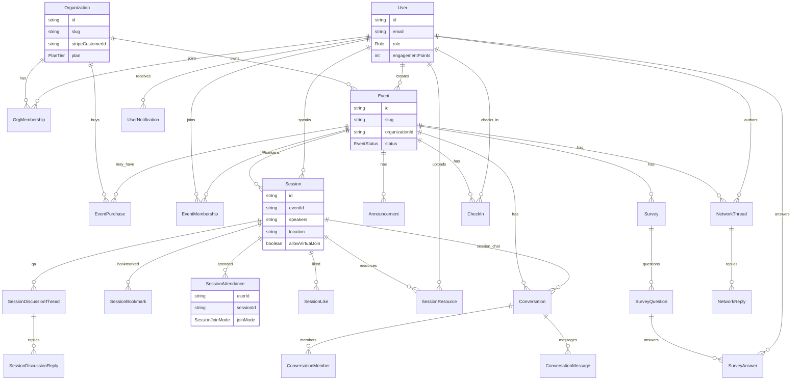

# GAP_REPORT.md — Phase 0 Codebase Audit

**Repo:** DocWeekSched (EventPilot / ukedl.com)  
**Audited:** 2026-07-17  
**Scope:** Entire monorepo at repo root. No code was changed in this session.

This report maps `PRODUCT_SPEC.md` onto the current codebase. Later phases should start every session with: *Read PRODUCT_SPEC.md and GAP_REPORT.md first.*

---

## 1. Stack

| Layer | Reality |
|---|---|
| **Monorepo** | npm workspaces: `apps/api`, `apps/web`, `apps/mobile`, `packages/shared` |
| **Languages** | TypeScript throughout |
| **Web** | **Next.js 14.2.5** (Pages Router), React 18.3.1 — `apps/web` |
| **API** | **Express 4.19.2** — `apps/api` |
| **Mobile** | Expo / React Native shell in `apps/mobile` (login + basic screens; far thinner than web) |
| **Shared** | `@event-app/shared` — thin TypeScript types only (`packages/shared/src/index.ts`) |
| **Database** | **PostgreSQL** via `DATABASE_URL` |
| **ORM** | **Prisma 5.18.0** (`apps/api/prisma/schema.prisma` + migrations) |
| **Auth** | Custom **JWT** (`jsonwebtoken`, HS256, 7-day expiry) + **bcrypt**; Bearer token in `Authorization` header; token stored in **`localStorage`** (not httpOnly cookies). No NextAuth / Auth.js / session cookies. |
| **Validation** | Zod on request bodies |
| **Email** | Optional **Resend** via raw `fetch` to `api.resend.com` (`apps/api/src/lib/mail.ts`). Used for invite + password-reset emails. No provider interface. If `RESEND_API_KEY` unset, URLs are logged server-side. |
| **Background jobs** | **None** — no queue, cron, worker, or job table |
| **Object storage** | **None** — files/images stored as data-URLs / long strings in Postgres |
| **Hosting / deploy** | **Web → Netlify** (`netlify.toml`, `@netlify/plugin-nextjs`); **API → Render** (`render.yaml`, free Node plan). Env: `.env` / `.env.example`. |
| **AI** | **None** — no gateway, no provider SDKs |
| **Billing SDKs** | **None** in dependencies; Stripe *keys documented* in `.env.example` only |

**Notable env defaults (`apps/api/src/lib/env.ts`):** `JWT_SECRET` falls back to `"dev-secret"` if unset — forgeable tokens in misconfigured deploys.

---

## 2. Data model

### 2.1 Entity list

| Entity | Purpose | Notes |
|---|---|---|
| **Organization** | Intended tenant + billing container | Schema only — **never read/written in API code** |
| **OrgMembership** | User ↔ Org role (`OWNER` / `ADMIN` / `MEMBER`) | Schema only — unused |
| **EventMembership** | User ↔ Event role (`ADMIN` / `ATTENDEE` / `SPEAKER`) | Schema only — unused for auth |
| **EventPurchase** | Per-event Stripe purchase record | Schema only — unused |
| **User** | Global account | Single global `role` (`ADMIN` / `ATTENDEE` / `SPEAKER`); profile fields; `engagementPoints`; invite + password-reset tokens |
| **Event** | Conference / program instance | `slug` unique; optional `organizationId`; `createdById`; status `DRAFT`/`ACTIVE`/`ARCHIVED`; plan/cap fields unused in routes |
| **Session** | Talk / block on the agenda | Belongs to Event; free-text `speakers`; optional `speakerId` → User; room is free-text `location` |
| **SessionBookmark** | Saved session | Present; My Schedule primarily uses attendance, not bookmarks |
| **SessionAttendance** | Join / leave + **joinMode** (`VIRTUAL` / `IN_PERSON` / `ASYNC`) | Core of My Schedule + mode counts |
| **SessionLike** | Like a session | Feeds engagement points |
| **SessionResource** | Link or FILE (data-URL) on a session | `kind` LINK/FILE; `url` string |
| **SessionDiscussionThread** / **SessionDiscussionReply** | Session Q&A | Flat thread + replies; no upvotes |
| **Announcement** | Event announcement text | No segmented targeting; no notification fan-out |
| **Survey** / **SurveyQuestion** / **SurveyAnswer** | Surveys | Routes ignore `x-event-id` (always default event) |
| **Conversation** / **ConversationMember** / **ConversationMessage** | EVENT / DIRECT / GROUP / SESSION chat | Event-scoped `eventId` |
| **CheckIn** | Event check-in (`userId`+`eventId` unique) | API exists; no QR / staff scanner UI in web inventory |
| **NetworkThread** / **NetworkReply** | Community spaces | Channels: GENERAL, MEETUP, MOMENTS, LOCAL, ICEBREAKER |
| **UserNotification** | In-app notifications | Kinds: COMMUNITY_THREAD, COMMUNITY_REPLY, MESSAGE, ADMIN_REQUEST |

**Absent (needed by PRODUCT_SPEC):** SessionItem / papers, Track, Room entity, EventSeries, WaitlistEntry, VenueMap/MapPin, CFP models, feature registry, audit log, AI metering, plan entitlement enforcement tables in use.

### 2.2 How users / events / sessions / speakers / attendees relate

```
User (global role)
  ├── creates → Event (createdById)   [optional organizationId → Organization — unused]
  ├── SessionAttendance / Like / Bookmark → Session → Event
  ├── speakerId on Session (optional single User) + free-text Session.speakers
  ├── ConversationMember / messages (scoped by Conversation.eventId)
  ├── NetworkThread / Reply (eventId)
  ├── CheckIn (eventId)
  └── UserNotification (optional eventId)

EventMembership / OrgMembership exist in schema but are NEVER enforced.
Attendee of an event ≈ any authenticated User who can set x-event-id to that event —
there is no join/membership gate on most reads.
```

Speakers are **not** a first-class roster entity: free-text names on `Session.speakers`, plus optional `Session.speakerId` → `User`.

### 2.3 `/e/<slug>` and `?event=` token

| Mechanism | Implementation |
|---|---|
| **`/e/<slug>`** | `apps/web/pages/e/[slug].tsx` — client-only shell. Calls public `GET /event/slug/:slug`, writes `localStorage.activeEventId`, redirects to `/?event=<eventId>`. |
| **`GET /event/slug/:slug`** | `apps/api/src/routes/event.ts` — unauthenticated; matches **either** `Event.slug` **or** raw `Event.id` (CUID). Returns id, name, slug, banner, timezone, dates. |
| **`?event=`** | `apps/web/pages/index.tsx` — resolves via same slug endpoint (ID or slug), stores `activeEventId`. |
| **API scoping** | Subsequent calls send client-chosen `x-event-id` header (`apps/web/lib/api.ts` / dashboard helpers). Server trusts that header (`resolveEventFromRequest`); invalid ID **silently falls back** to the “default” event (most sessions). |

There is no separate opaque invite “token” for event entry beyond the public slug (and user invite `profileSetupToken` for account setup). Join links do not expire or revoke.

### 2.4 Session sub-items (papers / presentations)?

**No.** Sessions are flat. No `SessionItem`, ordered authors, discussant, or paper abstract model. Academic paper-in-session is a Phase 2 build.

### 2.5 Mermaid ER diagram



*(Gray-box reality: Organization / OrgMembership / EventMembership / EventPurchase are schema-only today.)*

---

## 3. Auth & authorization

### 3.1 Flows

| Flow | How it works | Gaps vs PRODUCT_SPEC Phase 1 |
|---|---|---|
| **Register** | `POST /auth/register` — creates ATTENDEE/SPEAKER; bcrypt hash; returns JWT | No email verification; no breached-password check; min length not hardened to 8 + list |
| **Register admin** | `POST /auth/register-admin` — requires `ADMIN_INVITE_CODE` env | Static shared secret; no rate limit |
| **Login** | `POST /auth/login` — email/password → JWT | No rate limit / lockout; errors may distinguish invalid cases depending on path |
| **Password reset** | `forgot-password` always `{ok:true}`; stores plain hex token (2h); email via Resend | Token not hashed in DB; no rate limit |
| **Invite setup** | `profileSetupToken` on User; `GET/POST /auth/profile-setup` | Token **never expires** (`expiresAt: null` on invite); stored plain |
| **Session** | JWT in localStorage, 7d, no refresh/revocation | XSS-stealable; not HttpOnly/Secure/SameSite cookies |
| **Email verified?** | **No** | Required in Phase 1 |
| **Roles** | Global `User.role` only. `requireRole(["ADMIN"])` = admin of **all** events | No OWNER/ADMIN/STAFF per org; EventMembership unused |

### 3.2 “Request administrator access” — end to end

1. **UI:** Profile tab → button “Request administrator access” (`dashboard.tsx` ~2304) → `POST /attendees/admin-access-request` with `x-event-id`.
2. **API:** Rejects if already ADMIN; loads **all** global ADMIN users; `notifyMany` with kind `ADMIN_REQUEST` (in-app only — **no email**).
3. **Admin sees:** Notifications tab copy points them to Participants; they click **Make admin** → `POST /attendees/:id/make-admin`.
4. **Promotion:** Sets `User.role = ADMIN` **globally** — not per-event / per-org. No OWNER approval gate, no audit log, no request expiry/cancel.

**Verdict:** Reads as **self-service privilege escalation assisted by any global admin**, exactly as PRODUCT_SPEC flags. Phase 1 must rewire this to org OWNER grant + EventMembership/OrgMembership.

### 3.3 API route authorization inventory

Legend: **CRITICAL** = missing auth, client-trusted tenancy, or global-admin acting across tenants without ownership check.

| Route | Auth | AuthZ / tenancy | Flag |
|---|---|---|---|
| `GET /health` | None | Public | OK |
| `POST /auth/register` | None | Public | OK (add verify + rate limit in P1) |
| `POST /auth/register-admin` | Invite code | Static code | CRITICAL if code weak / leaked |
| `POST /auth/login` | None | No rate limit | CRITICAL (brute force) |
| `POST /auth/forgot-password` | None | No rate limit | CRITICAL |
| `POST /auth/reset-password` | Token | OK pattern | — |
| `GET /auth/profile-setup/:token` | Token | Exposes PII; never expires | CRITICAL (non-expiring invite) |
| `POST /auth/profile-setup` | Token | Issues JWT | — |
| `GET /auth/me` | requireAuth | — | OK |
| `POST /auth/me/reset-engagement` | ADMIN | Global admin | — |
| `PUT /auth/me/profile` | requireAuth | Own profile | OK |
| `GET /event/slug/:slug` | **None** | Public metadata; accepts raw id | OK for landing; note ID oracle |
| `GET /event/` | requireAuth | **Trusts `x-event-id`**; no membership | **CRITICAL** |
| `GET /event/mine` | ADMIN | Filters `createdById` | Partial (global admin only) |
| `POST /event/` | ADMIN | No org; no billing gate | CRITICAL vs multi-tenant |
| `PUT /event/` | ADMIN | **Any admin + any `x-event-id`** | **CRITICAL** |
| `GET /sessions/` | requireAuth | Via event header | CRITICAL (no membership) |
| `GET /sessions/me` | requireAuth | **All events’ attendance** | **CRITICAL** |
| `GET /sessions/:id` | requireAuth | Event-scoped select | Partial |
| `POST /sessions/` | ADMIN | Event from header | **CRITICAL** (cross-event write) |
| `PUT/DELETE /sessions/:id` | ADMIN | **By session id only** | **CRITICAL** |
| `PUT /sessions/:id/attendance` | requireAuth | No event membership | **CRITICAL** |
| `PUT/DELETE /sessions/:id/like` | requireAuth | No event membership | **CRITICAL** |
| `GET/POST /sessions/:id/resources` | requireAuth | Joiner or ADMIN | Partial |
| `DELETE .../resources/:resourceId` | requireAuth | Owner or ADMIN | Partial |
| `GET/POST /sessions/:id/conversations` | requireAuth | **No event check** | **CRITICAL** |
| `POST .../replies` | requireAuth | Thread∈session | Partial |
| `DELETE` Q&A (thread/reply) | ADMIN | Global admin | CRITICAL cross-tenant |
| `GET/POST /announcements/` | auth / ADMIN | `resolveEventFromRequest` | CRITICAL (header trust) |
| `GET/POST /surveys/` | auth / ADMIN | **Ignores `x-event-id`** → default event | **CRITICAL** |
| `POST /surveys/:id/answers` | requireAuth | **No event check**; questionIds unchecked | **CRITICAL** |
| `GET /conversations/` | requireAuth | Event header | CRITICAL (header trust) |
| `POST /conversations/direct` | requireAuth | Event header | Partial |
| `POST /conversations/group` | requireAuth | **memberIds not same-event validated** | **CRITICAL** |
| `GET/POST /conversations/:id/messages` | requireAuth | Member check for non-EVENT | Partial; EVENT broadcast uses **all users** |
| `GET /attendees/` | requireAuth | **All users in DB** | **CRITICAL** |
| `POST /attendees/invite` (+ bulk) | ADMIN | Any event via header | **CRITICAL** |
| `POST /attendees/admin-access-request` | requireAuth | Notifies all global admins | CRITICAL (escalation design) |
| `POST /attendees/:id/make-admin` | ADMIN | **Global promote, any user id** | **CRITICAL** |
| `POST /attendees/:id/remove-admin` | ADMIN | Global | CRITICAL |
| `DELETE /attendees/:id` | ADMIN | **Any non-admin user** | **CRITICAL** |
| `POST/GET /checkins*` | auth / ADMIN | Event header | CRITICAL (header trust) |
| `GET/POST /network/threads` (+ replies/deletes) | auth / ADMIN | Event header; deletes global ADMIN | CRITICAL (header + global role) |
| `GET/PATCH /notifications*` | requireAuth | userId + eventId filter | Partial (`allAttendeeUserIds` producers are wrong) |

**Structural CRITICAL (applies to almost every “ADMIN” route):** authorization is **global role + client-supplied `x-event-id`**, not org/event membership. That is a client-trusted tenancy boundary.

---

## 4. Tenancy risk

Queries / behaviors that leak or mutate **another event’s (or all users’) data** given a manipulated ID or header:

| # | Risk | Evidence |
|---|---|---|
| T1 | **Any ADMIN edits any Event** via `x-event-id` | `PUT /event/` |
| T2 | **Any ADMIN creates sessions / invites / announcements** on any event | Sessions, attendees, announcements + header |
| T3 | **Any ADMIN updates/deletes any Session by id** | `PUT/DELETE /sessions/:id` — no `eventId` ownership |
| T4 | **`GET /attendees/` returns every User** (email, name, role, …) | `attendees.ts` `findMany` with no event filter |
| T5 | **`GET /sessions/me` cross-event attendance leak** | No `eventId` filter |
| T6 | **Session Q&A read/write by session id alone** | `findSessionOr404` ignores event |
| T7 | **Attendance / likes on foreign sessions** | No membership / event match |
| T8 | **Surveys always hit “default” event**; answers by survey id alone | `surveys.ts` |
| T9 | **Group chat can add arbitrary userIds** | `POST /conversations/group` |
| T10 | **`allAttendeeUserIds()` = all Users** — community + EVENT broadcasts notify / target everyone | `lib/notifications.ts` |
| T11 | **`resolveEventFromRequest` silent fallback** to wrong event on bad header | `lib/requestEvent.ts` |
| T12 | **`make-admin` / `DELETE` attendees** not scoped to an event roster | Global user table |
| T13 | **Organization / EventMembership never enforced** — schema is dead weight | Grep of `apps/api/src`: zero usages |
| T14 | Public slug endpoint accepts **raw event CUID** as well as slug | Enumerate/open by id |

Phase 1 acceptance (“swap event/org ID → 403/404”) **fails today** on nearly all of the above.

---

## 5. Feature inventory

| Feature | Rating | Notes |
|---|---|---|
| **Agenda + timezone toggle** | **Complete** | Event Schedule view; MY vs EVENT timezone in dashboard + session page |
| **My Schedule** | **Complete** | JOINING attendances grouped by day; some ICS download helpers exist (not full calendar subscription) |
| **Attendance modes** (in-person / virtual / async) | **Complete** | Enum + UI switcher + per-mode counts; `allowVirtualJoin` enforcement |
| **Session pages + resources + Q&A** | **Complete** | `pages/session/[sessionId].tsx`; resources + threaded Q&A; admin delete |
| **Attendee directory + search** | **Partial** | Works (search name/email/interests, A–Z index) but **not event-scoped** and **not opt-in**; blank empty search UX called out in spec |
| **Single + CSV invites** | **Complete** | Invite + bulk CSV parser (example CSV, caps); Resend optional |
| **Roster admin** | **Partial** | Make/remove admin, delete, invite status — but **global** admin model; stacked buttons (no kebab); hard deletes |
| **Community spaces** | **Complete** | All five channels with meetup/moments/maps affordances |
| **DMs / groups / event chat** | **Complete** | DIRECT, GROUP, EVENT broadcast; messaging UI in dashboard |
| **Notifications** | **Partial** | In-app list + poll + mark read; **no** budget, digest, quiet hours, email/push classes; per-tab unread gold badge (conflicts with calm “one inbox” later) |
| **Profiles + engagement points** | **Complete** | Profile fields, gem tiers, point awards table in `lib/points.ts` |
| **Multi-event creation** | **Partial** | Admins create events + “My Events”; no org, no publish workflow enforcement for outsiders, no billing gate |

**Also present but thin:** Announcements (basic), Surveys (broken tenancy), Check-in API (no full QR scanner UX), Session likes, data-URL logos/banners.

---

## 6. Billing readiness

| Area | Status |
|---|---|
| Prisma models | `Organization`, `EventPurchase`, `PlanTier`, `SubscriptionStatus`, Stripe id fields on Org — **present** |
| API / webhooks / checkout | **Absent** — no routes, no Stripe/Paddle/Lemon Squeezy SDK |
| Entitlement helpers | **Absent** — `POST /event` has no plan check |
| `.env.example` | Comments for `STRIPE_*`; notes “without key, checkout activates events in development” — **no such code found in `apps/api/src`** |
| PRODUCT_SPEC MoR | Spec wants Paddle/Lemon Squeezy-class MoR behind an interface; codebase comments lean Stripe stub |

**Rating: Stub (schema only).** Phase 3 starts from nearly zero application logic; can either wire Stripe as interim or implement MoR provider interface cleanly.

---

## 7. Ops

| Area | Status |
|---|---|
| **Tests** | **0** test files (`*.test.*` / `*.spec.*`) under apps/packages |
| **Coverage areas** | None |
| **CI** | **No** `.github/workflows` (or other CI) in repo |
| **Lint-in-CI** | Not configured at root |
| **Error tracking** | **None** (no Sentry etc.) |
| **Backups** | Rely on host DB (e.g. Neon) managed backups only — **no** documented restore drill / RUNBOOK |
| **Environments** | Prod split: Netlify (web) + Render (API). **No staging** blueprint |
| **Health** | `GET /health` → `{ ok: true }` only |
| **Logging / audit** | Console logs; no structured request IDs; no audit table |

---

## 8. Design / frontend audit

### 8.1 Gold `#E8C547` / `--gold`

Defined in `apps/web/styles/globals.css` `:root { --gold: #e8c547; }`. Slate theme overrides to `#eab308`.

**Uses on light / white backgrounds (contrast fails — matches PRODUCT_SPEC ~1.7:1):**

| Location | Issue |
|---|---|
| `a { color: var(--gold); }` | Links on white/light page |
| `.schedule-speaker` / speaker name rules | Gold text on white agenda cards |
| `.join-mode-switch button.is-active { color: var(--gold); }` | Gold on pale yellow tint |
| `.points-pill { color: var(--gold); }` | Gold on pale gold wash |
| `.attendee-index-letter:hover` | Gold on light toolbar |
| `EventPilotLogo.tsx` calendar dot `fill="#e8c547"` | On near-white `#f8fafc` |

**Acceptable / decorative on dark:**

| Location | Notes |
|---|---|
| `.session-back-link` | On navy app shell |
| Logo pilot helmet ellipse | On navy fuselage |
| `.nav-unread-badge` gradient `#e8c547 → #c9a227` with dark text | Gold *as background* (better than gold text on white) |

**Phase 2.5 fix:** use `--gold-700 #7A5A00` for text on light; reserve `#E8C547` for on-navy decoration only.

### 8.2 Font-family: explicit vs inherit

| Selector | `font-family` |
|---|---|
| `body` | `"Lato", "Segoe UI", "Helvetica Neue", Arial, sans-serif` |
| `.header h1`, `.login-guest-event-name`, `.schedule-day-heading` | `"Merriweather", Georgia, serif` |
| `.input, .select, .textarea` | **`inherit`** (explicit) |
| `.button`, `.nav button`, bare `<button>` | **Not set** |

**Confirmed:** Form controls / buttons use the UA stylesheet unless overridden. Inputs/selects/textareas inherit Lato; **buttons do not** → commonly compute as **Arial ~13.33px**. Phase 2.5 requires global `button, input, select, textarea { font: inherit; }`.

### 8.3 Session-resource storage

| Layer | Cap / behavior |
|---|---|
| Client | `RESOURCE_DATA_URL_MAX_CHARS = 4_500_000` in `session/[sessionId].tsx` |
| API Zod | `url` max **5_000_000** chars; FILE must `startsWith("data:")` |
| Express | `express.json({ limit: "25mb" })` |
| DB | `SessionResource.url` unbounded Postgres text |

**Confirmed: data-URL storage in DB, ~4.5 MB practical client cap.** No S3/R2/Blob code or migration scripts.

**Migration path (for Phase 2):** introduce object storage + presigned upload; store `https://…` URLs in `SessionResource.url`; backfill optional (existing data-URLs keep working until re-upload); tighten MIME/size server-side; drop mega JSON body limit once uploads leave the API process. Same pattern needed for profile photos / event logo/banner (also large string fields).

### 8.4 Notification-producing code paths (Phase 4 budget inventory)

All writes go through `notifyMany` → `userNotification.createMany` in `apps/api/src/lib/notifications.ts`.

| # | Trigger | Call site | Kind | Recipients today |
|---|---|---|---|---|
| N1 | New community thread | `POST /network/threads` → `notifyNewCommunityThread` | `COMMUNITY_THREAD` | **All users** (or meetup invitee list); plus self confirmation |
| N2 | Community reply | `POST /network/threads/:id/replies` → `notifyCommunityReply` | `COMMUNITY_REPLY` | Thread author + prior repliers; plus self |
| N3 | DM / group message | `POST /conversations/:id/messages` → `notifyNewMessage` | `MESSAGE` | Conversation members except sender |
| N4 | EVENT admin broadcast | same route when type EVENT + ADMIN | `MESSAGE` | **`allAttendeeUserIds()` = every user** |
| N5 | Admin access request | `POST /attendees/admin-access-request` | `ADMIN_REQUEST` | All global ADMINs |

**Does not notify today:** announcements, session Q&A posts, likes, attendance changes, invites (email only), password reset (email only).

**Implications for calm budget:** N1/N4 are unbounded fan-out bugs in multi-event deployments; everything is immediate in-app (polled), no INTERRUPT vs DIGEST class, no quiet hours, no push, no daily digest email.

### 8.5 Other frontend notes

- **RESEND_API_KEY in UI:** instructional `<code>RESEND_API_KEY</code>` text on invite panel — **name only**, not the secret (still a polish smell per PRODUCT_SPEC).
- **PWA:** none (no manifest / service worker).
- **Branding:** “EventPilot” hardcoded in pages/logo; no central config module.
- **Mobile:** Expo app exists with API login/schedule/messages stubs — not feature-parity with web; PRODUCT_SPEC says PWA-only (mobile app is optional debt).

---

## 9. Phase mapping (PRODUCT_SPEC → this codebase)

| Phase | Exists | Missing | Blast radius |
|---|---|---|---|
| **0 — Audit** | This file | Keep updated as phases land | Docs only |
| **1 — Tenancy, roles, security** | JWT/bcrypt; Event.slug; unused Org* schema | Wire Organization; `requireOrgRole` / `requireEventAccess`; fix all §3–§4 CRITICALs; email verify; rate limits; secure cookies; CSRF/headers; branding config; harden admin-request + invite expiry | **High** — every API route + auth storage + migration of existing users/events into a default org |
| **2 — Organizer self-service + SessionItems + Series + storage** | Event CRUD (admin), sessions CRUD, CSV invites, modes | Org signup wizard; Draft/Published gates; SessionItems; Tracks/Rooms; EventSeries clone; object storage; email provider interface; review-changeset CSV dry-run | **High** — schema + dashboard organizer UX + upload pipeline |
| **2.5 — Design tokens + organizer polish** | Merriweather/Lato, navy/blue, gold var | Token module; gold-on-white fix; `font: inherit` on buttons; roster kebab; settings modal; session drawer; ConfirmDialog; styleguide; empty/loading states | **Medium** — mostly `globals.css` + dashboard/session UI |
| **2.6 — Feature registry** | Features always on | Registry + `EventFeatureConfig` + `featureEnabled` + settings UI + API 404s | **Medium** — wrap every attendee surface + many routes |
| **3 — Billing (MoR)** | Schema stub (Stripe-shaped) | MoR provider, webhooks, `can`/`limit`, /pricing, enforcement on create/invite | **Medium–High** — new billing module; gate existing create/invite |
| **P1 — Capacities / waitlists** | Unlimited joins + mode counts | Capacity fields, WaitlistEntry, transactional promote, notifications | **Medium** — attendance endpoint + session UI |
| **P2 — Venue maps** | Free-text `location` | VenueMap/MapPin, editor, attendee map UI | **Low–Medium** — new feature island + storage |
| **4 — Attendee baseline + calm notifications** | Agenda, My Schedule, directory, DMs, basic notifications, modes | Filters/search depth, ICS subscription, opt-in directory, meeting requests, segmented announcements, **notification budget/digest/quiet hours**, PWA, web push | **High** — notification lib rewrite + PWA + many UX upgrades; must not regress modes/community |
| **4.5 — Attendee polish** | Full dashboard | Login cleanup, branded 404/500, card declutter, responsive 390px, message/community composers | **Medium** — UI-heavy |
| **A0 — AI gateway** | Nothing | `lib/ai/gateway`, metering, grounding, lint rule, audit, digest-class hook | **Low** as isolated module; foundation for all agents |
| **A1 — Agenda ingest** | Nothing | Upload → extract → review-changeset → draft sessions/items | **Medium** — depends A0 + SessionItems + storage |
| **A2 — Setup copilot** | Nothing | Chat wizard + feature diff cards | **Medium** — depends A0 + 2.6 |
| **P3 — CFP** | Nothing | Forms, blind review, REVIEWER role, convert to Session/SessionItem | **High** — new domain + roles |
| **A3 — Concierge** | Nothing | Tool-calling chat on attendee pages | **Medium** — depends A0 + agenda APIs |
| **A4 — Matchmaker** | Interests text only | Embeddings, digest suggestions, draft DMs | **Medium** — depends directory opt-in + A0 |
| **5 — Engagement & analytics** | Points, basic Q&A, check-in API, likes | Q&A votes, polls, feedback, QR scanner offline, analytics dashboard, sponsors; quiet points | **High** — new surfaces; ingest existing points |
| **P4 — Badges & certificates** | Nothing | PDF pipelines, verify URL | **Medium** — depends check-in |
| **A5 — Ops agent** | Nothing | Detectors + draft cards | **Medium** — depends announcements/Q&A/capacity |
| **A6 — Recap agent** | Nothing | Report workspace + series checklist hook | **Medium** — depends analytics/certificates |
| **6 — Marketing / legal / SSR** | Client `/e/[slug]` shell; login at `/` | Landing, /pricing, demo event, legal, SSR event pages, rename, GDPR export | **High** for routing (`/` move) + SEO |
| **S1 — Support** | None | /help, assistant, tickets | **Low–Medium** |
| **S2 — Solo ops** | Health only | Alerting, degradation mode, kill switches, backups/restore, ZAP | **Medium** — infra |
| **S3 — Growth** | None | SEO schema, lifecycle email, analytics, referral | **Medium** |
| **S4 — Founder console** | None | /founder + MFA + impersonation | **Medium** — new privileged surface |
| **7 — Launch readiness** | Split Netlify/Render deploy | Sentry, audit log, CI gate, load test, RUNBOOK, LAUNCH_CHECKLIST | **Medium** — cross-cutting |

### Strengths to protect (do not regress)

Per PRODUCT_SPEC Part II: attendance modes + counts, timezone toggle, community channels, CSV bulk invite, session Q&A, engagement points, multi-event creation.

### Highest-priority CRITICAL themes before charging customers

1. **Global ADMIN + client `x-event-id`** (cross-tenant read/write).  
2. **`GET /attendees/` and `allAttendeeUserIds()`** (global PII / notify fan-out).  
3. **Admin-request → global `make-admin`**.  
4. **JWT `dev-secret` fallback + localStorage tokens + no rate limits**.  
5. **Data-URL uploads** (DB bloat / 4.5 MB ceiling) before scale.

---

*End of GAP_REPORT.md — Phase 0 complete. Next: Phase 1 (tenancy, roles, security), after an explicit migration plan review.*
